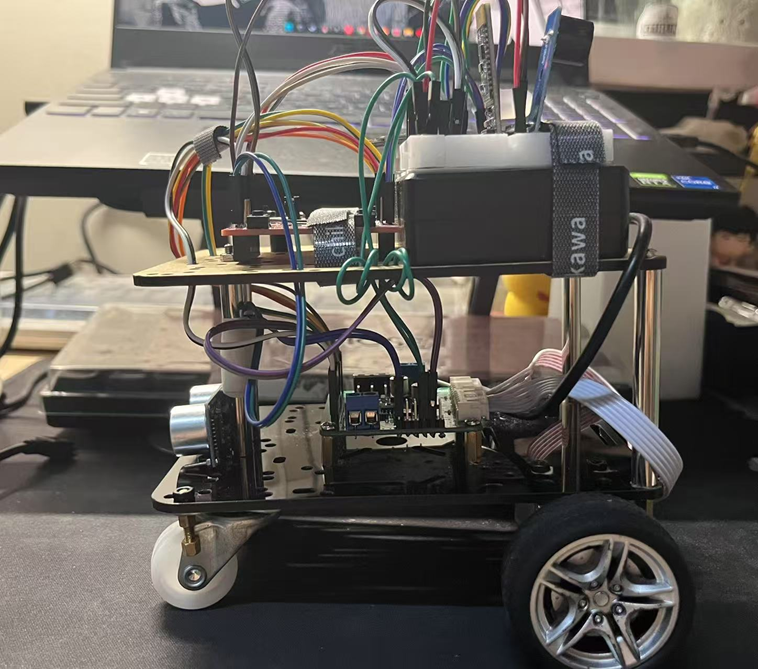

# TM4C123 Bluetooth Smart Car Project

## Project Demo



## Overview

This project is based on the TI TM4C123GH6PM microcontroller and implements a smart car with Bluetooth remote control, OLED display, ultrasonic obstacle avoidance, and MPU6050 accelerometer. You can control the car's movement, speed, and distance measurement via a mobile Bluetooth app.

## Features

- Bluetooth (JDY-31) serial remote control
- OLED screen information display
- Ultrasonic (HC-SR04) distance measurement and obstacle avoidance
- MPU6050 accelerometer data acquisition
- Motor PWM speed control and encoder speed measurement
- Buzzer and multi-color LED indicators

## Hardware Connections

| Module           | TM4C123 Pin(s)      |
|------------------|---------------------|
| Bluetooth JDY-31 | UART5 (PE4/PE5)     |
| OLED             | I2C0 (PB2/PB3)      |
| Ultrasonic TRIG  | PA7                 |
| Ultrasonic ECHO  | PA6                 |
| Buzzer           | PA5                 |
| RGB LEDs         | PA2/PA3/PA4         |
| Motor PWM/Encoder| See code comments   |
| MPU6050          | I2C0 (PB2/PB3)      |

## Project Structure

```
.
├── main.c           // Main program
├── buct_hal.c/h     // Hardware abstraction layer
├── i2c.c/h          // I2C driver
├── oled.c/h         // OLED driver
├── accel_6050.c/h   // MPU6050 driver
├── tm4c123.h        // MCU register definitions
├── tm4c123gh6pm_startup_ccs.c // Startup file
├── ...
```

## Command List

Send the following characters via Bluetooth to control the car:

| Command | Function         |
|---------|------------------|
| F       | Move forward     |
| B       | Move backward    |
| L       | Turn left        |
| R       | Turn right       |
| S       | Stop             |
| M       | Measure distance |
| V       | Show speed       |
| ...     | See code         |

## Build & Flash

1. Import the project into TI Code Composer Studio (CCS)
2. Select TM4C123GH6PM LaunchPad as the target board
3. Build and flash the program to the board

## Main Functions

- `main.c`: Main loop, Bluetooth command parsing, and function dispatch
- `InitUART5()`: Initialize Bluetooth UART
- `InitUltrasonic()`: Initialize ultrasonic sensor
- `MeasureDistance()`: Measure and return distance
- `OLED_ShowString()`: Display string on OLED
- `moveForward()/moveBackward()`: Motor control

## Credits

- Guidance from Prof.Guo & Prof Frank
- All team members for their contributions


You are welcome to contribute to this project!