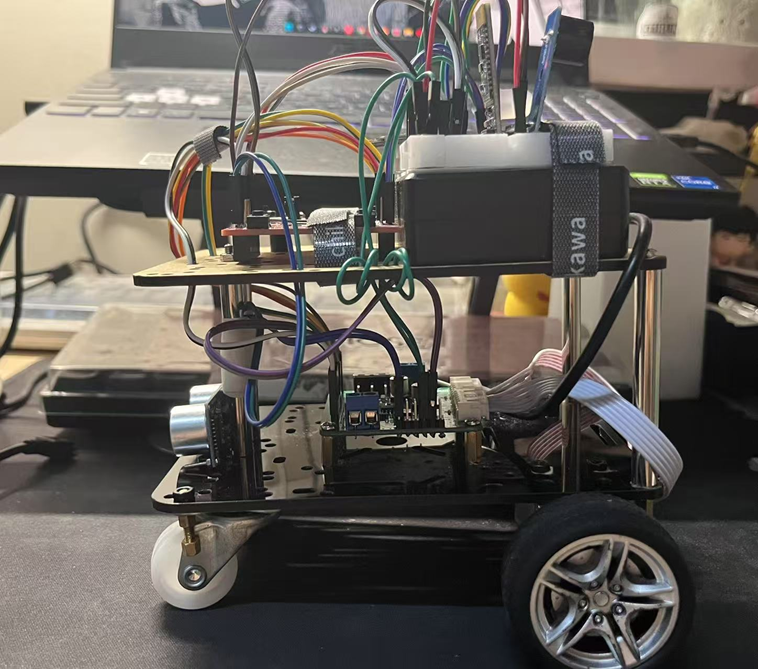

# TM4C123 蓝牙遥控小车项目

## 小车图片



## 项目简介

本项目基于TI TM4C123GH6PM单片机，实现了一个支持蓝牙遥控、OLED显示、超声波避障和MPU6050加速度计的智能小车。通过手机蓝牙发送指令，可控制小车前进、后退、转向、测速、测距等功能。

## 主要功能

- 蓝牙（JDY-31）串口遥控
- OLED屏幕信息显示
- 超声波（HC-SR04）测距与避障
- MPU6050加速度计数据采集
- 电机PWM调速与编码器测速
- 蜂鸣器与多色LED指示

## 硬件连接

| 功能模块      | 引脚连接（TM4C123） |
| ------------- | ------------------- |
| 蓝牙JDY-31    | UART5 (PE4/PE5)     |
| OLED          | I2C0 (PB2/PB3)      |
| 超声波TRIG    | PA7                 |
| 超声波ECHO    | PA6                 |
| 蜂鸣器        | PA5                 |
| 红绿蓝LED     | PA2/PA3/PA4         |
| 电机PWM/编码器| 见代码注释          |
| MPU6050       | I2C0 (PB2/PB3)      |

## 软件结构

```
.
├── main.c           // 主程序入口
├── buct_hal.c/h     // 硬件抽象层
├── i2c.c/h          // I2C驱动
├── oled.c/h         // OLED驱动
├── accel_6050.c/h   // MPU6050驱动
├── tm4c123.h        // MCU寄存器定义
├── tm4c123gh6pm_startup_ccs.c // 启动文件
├── ...
```

## 指令说明

通过蓝牙串口助手发送如下字符控制小车：

| 指令 | 功能         |
| ---- | ------------ |
| F    | 前进         |
| B    | 后退         |
| L    | 左转         |
| R    | 右转         |
| S    | 停止         |
| M    | 超声波测距   |
| V    | 显示速度     |
| ...  | 详见代码     |

## 编译与下载

1. 使用TI CCS导入本工程
2. 选择TM4C123GH6PM LaunchPad为目标板
3. 编译并下载程序到开发板

## 主要函数说明

- `main.c`：主循环，蓝牙指令解析与功能调度
- `InitUART5()`：初始化蓝牙串口
- `InitUltrasonic()`：初始化超声波传感器
- `MeasureDistance()`：测距并返回距离
- `OLED_ShowString()`：OLED显示字符串
- `moveForward()/moveBackward()`：电机控制

## 致谢

- 郭青老师和Frank的指导
- 各位组员的共同努力

欢迎contribution！